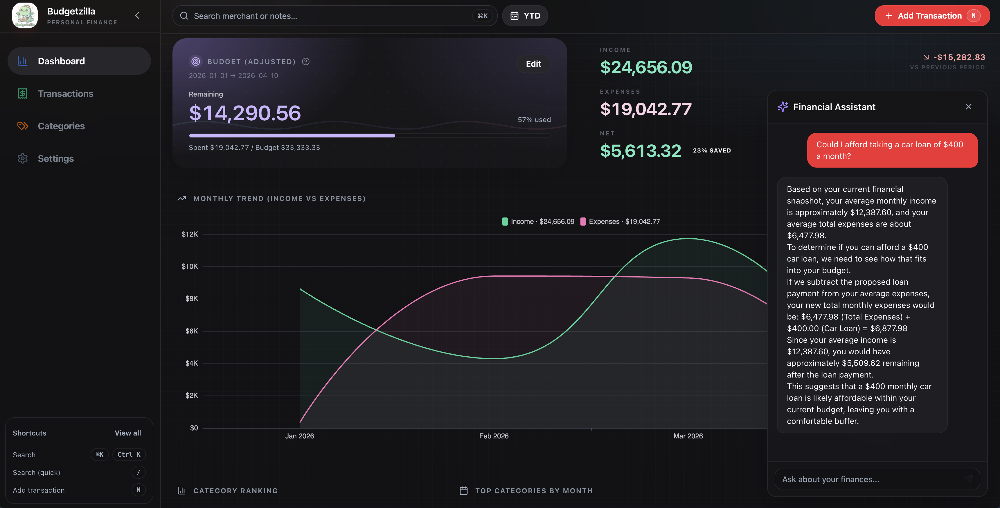

<p align="center">
  
</p>

<h1 align="center">Budgetzilla</h1>

<p align="center">
  <strong>Stop being the product. Track money locally.</strong><br/>
  Privacy-first • SQLite WASM • Browser-Native AI<br/>
  <i>No cloud, no logins, no tracking. Financial data stays on the local machine.</i>
</p>

<p align="center">
  <a href="https://budgetzilla-app.vercel.app/"><strong>🔥 Try the Web App</strong></a><br/>
  <a href="#-get-running">Quick Start</a> •
  <a href="https://budget-docs.vercel.app/">The Docs</a> •
  <a href="CONTRIBUTING.md">Join the Build</a>
</p>

<p align="center">
  
  
</p>

---

Budgetzilla is a local-first budgeting tool for total data privacy. It uses **SQLite WASM** for browser-based storage and **Gemma 4** for on-device receipt scanning. No photos or financial data ever leave the machine.

<p align="center">
  
</p>

## 💎 What makes it different?

- 🏠 **Local-First** — Data lives in the browser (OPFS). Budgeting works even when the internet is down.
- 🤖 **Private AI** — Snap a receipt and the on-device AI pulls the details. No cloud APIs, no data harvesting. 
- 📊 **Fast Insights** — Beautiful charts and spending trends that load instantly.
- ☁️ **Drive Sync** — Optional secure backups directly to a personal Google Drive. 
- 🚀 **Native Speed** — Run in the browser or use the native macOS/Windows app for a high-end feel.
- 🔍 **Keyboard Ninja** — `Cmd+K` for global search. `N` to add a transaction. Built for speed.

---

## 🚀 Get Running

### 🌐 In the Browser (Dev mode)

```bash
git clone https://github.com/Skyline-9/budgetzilla.git
cd budgetzilla/webapp
npm install
npm run dev
```
*Open `http://localhost:5173` to start.*

### 🖥️ Native Desktop App (Tauri)

```bash
cd webapp
npm run tauri:dev
```
*Requires Rust and build tools. [Check the full guide](https://budget-docs.vercel.app/getting-started/quick-start/).*

---

## 🛠 Tech Stack

- **UI:** React 18 + Tailwind CSS + Radix UI
- **DB:** SQLite WASM (sql.js) 
- **AI:** Gemma 4 (via Transformers.js / WebGPU)
- **Desktop:** Tauri 2.0 (Rust)
- **Sync:** Google Drive API

---

## 📁 Links for Nerds

- **[How it's built](Architecture.md)** — The local-first data flow.
- **[Design Goals](DESIGN.md)** — The Apple-inspired UI philosophy.
- **[Contributing](CONTRIBUTING.md)** — PRs are welcome! Check here to get started.

---

<p align="center">
  Built with ❤️ for privacy. Licensed under <a href="LICENSE">MIT</a>.
</p>
