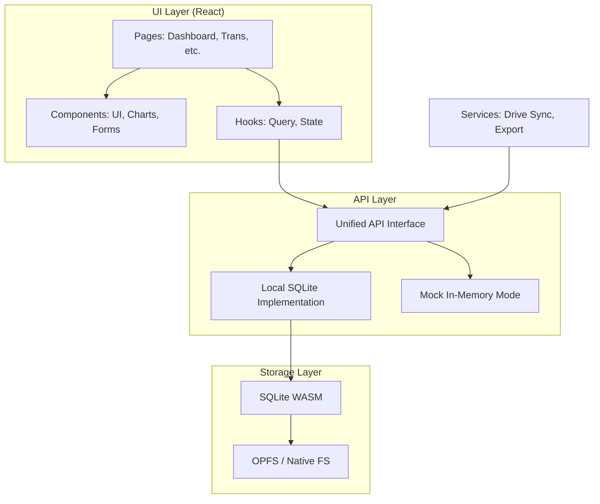

Budgetzilla follows a **local-first** architecture where all data operations happen in the browser or local desktop process without requiring a shared backend server.

## High-Level Overview



## Project Structure

```
budget/
├── webapp/                 # React application
│   ├── src/
│   │   ├── api/           # API client layer
│   │   │   ├── index.ts   # Unified API exports
│   │   │   ├── config.ts  # API configuration
│   │   │   └── local/     # SQLite implementation
│   │   ├── db/            # Database operations
│   │   ├── services/      # External services
│   │   ├── components/    # React components
│   │   ├── pages/         # Page components
│   │   ├── hooks/         # Custom React hooks
│   │   └── providers/     # React context providers
│   ├── src-tauri/         # Tauri desktop wrapper
│   │   ├── src/           # Rust backend code
│   │   └── tauri.conf.json # Tauri configuration
│   ├── public/            # Static assets
│   └── index.html         # Entry point
└── docs/                  # Documentation (Starlight)
```

## Technology Stack

### Frontend

| Technology | Purpose |
|------------|---------|
| React 18 | UI framework |
| TypeScript | Type safety |
| Vite | Build tool and dev server |
| Tailwind CSS | Styling |
| Radix UI | Accessible UI primitives |
| TanStack Query | Data fetching and caching |
| ECharts | Charts and visualizations |

### Database

| Technology | Purpose |
|------------|---------|
| sql.js | SQLite compiled to WebAssembly |
| OPFS | Browser file system for persistence |

### Desktop App (Tauri)

| Technology | Purpose |
|------------|---------|
| Rust | Native backend and system integration |
| Tauri | Desktop application framework |
| WebView2 / WKWebView | Native web views (Windows / macOS) |

## Data Flow

### Reading Data

1. Component calls API function (e.g., `getTransactions()`)
2. API layer routes to local implementation
3. Local implementation executes SQL query
4. Results transformed to TypeScript types
5. Data returned to component via TanStack Query

### Writing Data

1. Component calls mutation (e.g., `createTransaction()`)
2. API validates input data
3. SQL INSERT/UPDATE executed
4. Database persisted to OPFS
5. TanStack Query invalidates relevant caches
6. UI updates automatically

## Database Schema

### Transactions Table

```sql
CREATE TABLE transactions (
  id TEXT PRIMARY KEY,
  amount REAL NOT NULL,
  description TEXT NOT NULL,
  category_id TEXT NOT NULL,
  date TEXT NOT NULL,
  notes TEXT,
  created_at TEXT NOT NULL,
  updated_at TEXT NOT NULL,
  FOREIGN KEY (category_id) REFERENCES categories(id)
);
```

### Categories Table

```sql
CREATE TABLE categories (
  id TEXT PRIMARY KEY,
  name TEXT NOT NULL,
  color TEXT NOT NULL,
  icon TEXT,
  type TEXT NOT NULL CHECK (type IN ('expense', 'income')),
  created_at TEXT NOT NULL
);
```

### Budgets Table

```sql
CREATE TABLE budgets (
  id TEXT PRIMARY KEY,
  category_id TEXT NOT NULL,
  amount REAL NOT NULL,
  month TEXT NOT NULL,
  created_at TEXT NOT NULL,
  FOREIGN KEY (category_id) REFERENCES categories(id)
);
```

## API Design

The API layer provides a consistent interface regardless of the underlying implementation:

```typescript
// Transactions
getTransactions(filters?: TransactionFilters): Promise<Transaction[]>
getTransaction(id: string): Promise<Transaction>
createTransaction(data: CreateTransactionInput): Promise<Transaction>
updateTransaction(id: string, data: UpdateTransactionInput): Promise<Transaction>
deleteTransaction(id: string): Promise<void>

// Categories
getCategories(): Promise<Category[]>
createCategory(data: CreateCategoryInput): Promise<Category>
// ... similar pattern

// Budgets
getBudgets(month?: string): Promise<Budget[]>
setBudget(categoryId: string, amount: number, month: string): Promise<Budget>
// ... similar pattern
```

## Key Design Decisions

### Why Local-First?

- **Privacy**: Financial data stays on user's device
- **Speed**: No network latency for operations
- **Offline**: Works without internet
- **Simplicity**: No backend infrastructure to maintain

### Why SQLite WASM?

- **Familiar**: Standard SQL syntax
- **Robust**: Battle-tested database
- **Portable**: Same queries work everywhere
- **Performant**: Fast for typical budgeting data sizes

### Why OPFS?

- **Persistent**: Survives browser restarts
- **Private**: Not accessible to other sites
- **Fast**: Direct file system access (vs. IndexedDB)
